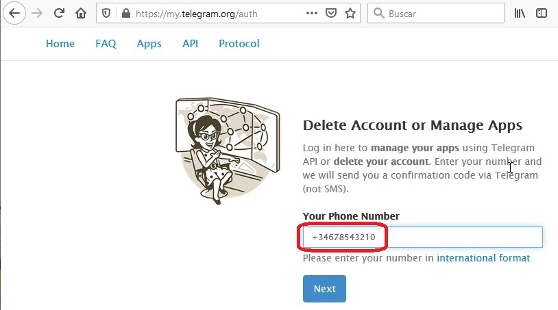
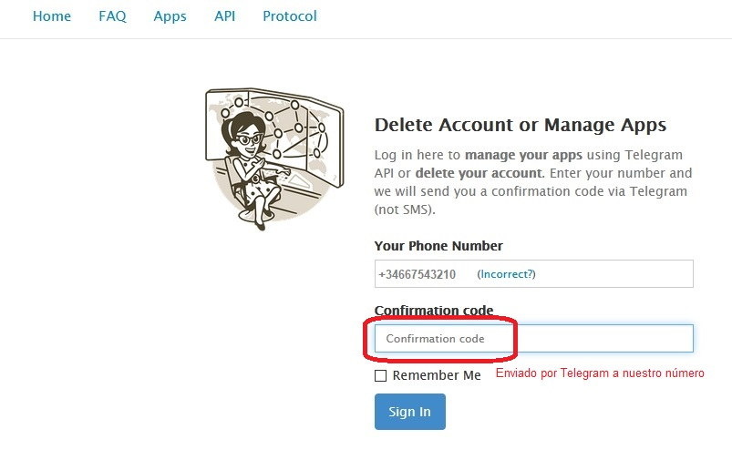
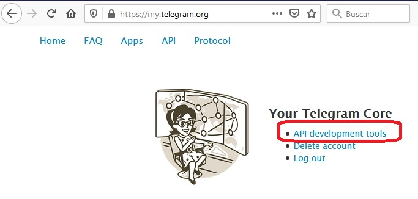
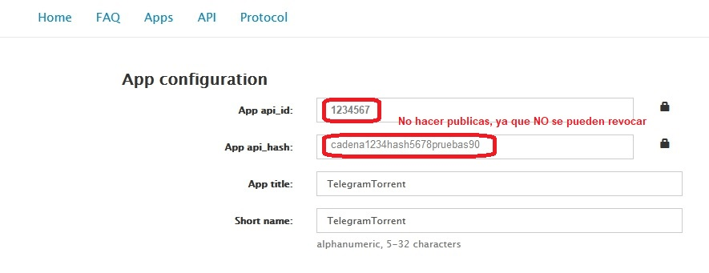

# BOT.Torrent - 3.1

## Creditos

Todo el merito de este script corresponde a Dekkar.

Otros colabores: jsavargas, 

## Manual de uso

### Pasos previos

1. Crear nuestro BOT en Telegram y obtener su TOKEN. Obtenemos: TG_BOT_TOKEN
2. Crear nuestra App en Telegram y obtener su api_id y api_hash. 
   Entrar en https://my.telegram.org/auth y generar la api. Obtenemos: TG_API_ID y TG_API_HASH
   Manuales más detallados en: 
   Para la app de Telegram debemos ir a la web https://my.telegram.org/auth, nos identificamos con nuestro número.
    
    Confirmamos con la clave que nos enviarán por mensaje a Telegram
    
    Luego vamos a la sección de API
    
    Y se nos presenta los dos valores que nos interesan. Api_id y Api_hash.
    
    Estos valores no debemos difundirlos... son únicos y NO podemos cambiarlos. Es decir no hay revocación posible como ocurre con el token.
    Estos valores deberemos anotarlos ya que tendremos que utilizarlos en las variables de entorno TG_API_ID y TG_API_HASH

3. Obtener user id enviando mensaje a este bot @userinfobot desde Telegram, y te devuelve tu id. 
    Es el ID de telegram. Obtenemos los usuarios para : TG_USERS_ARRAY

## Variables de entorno necesarias

- Actualizar el fichero de variables de entorno de ejemplo 'enviroment.samples' con los valores:

```ini

TG_API_ID=8979879
TG_API_HASH=05b8825669ae9dee51934
TG_BOT_TOKEN=123412341234:218f7e864f2500b544d2f
TG_DOWNLOAD_PATH=/download
TG_AUTHORIZED_USER_ID=1234567,12345679

```

- Renombrar el fichero con nombre '.env'

### Ejecutar mediante Docker Run

Ejecutar utilizando fichero de entorno llamado '.env'

```bash
docker run --rm -it --name bottorrent --env-file .env -v $pwd/data/path:/download  -v $pwd/data/watch:/watch bottorrent
```

### Ejecutar mediante Docker Compose

Ejemplo de docker-compose.yml

```yml
version: "3.9"
services:
  bottorrent:
    container_name: bottorrent
    image: 0netx/bottorrent
    labels:
        poc.bottorrent.description: "bottorrent container"
    volumes:
        - ./data/path:/download
        - ./data/watch:/watch        
    env_file:
        - .env
    #Alternativamente puedes usar lo siguiente:
    #environment:
    #    - 'TG_API_ID=168'
    #    - 'TG_API_HASH=3efd8c04ad'
    #    - 'TG_BOT_TOKEN=394:S4zPd09m-p4'
    #    - 'TG_DOWNLOAD_PATH=/download'
    #    - TG_AUTHORIZED_USER_ID=1234567,12345679
    restart: unless-stopped    
```

## Creating a Telegram Bot

1. Open a conversation with [@BotFather](https://telegram.me/botfather) in Telegram
2. Use the /newbot command to create a new bot. The BotFather will ask you for a name and username, then generate an authorization token for your new bot.
   The name of your bot is displayed in contact details and elsewhere.
   The Username is a short name, to be used in mentions and telegram.me links. Usernames are 5-32 characters long and are case insensitive, but may only include Latin characters, numbers, and underscores. Your bot's username must end in ‘bot’, e.g. ‘tetris_bot’ or ‘TetrisBot’.
   The token is a string along the lines of 110201543:AAHdqTcvCH1vGWJxfSeofSAs0K5PALDsaw that is required to authorize the bot and send requests to the Bot API. Keep your token secure and store it safely, it can be used by anyone to control your bot.

# LICENCIA

Este programa es software GRATUITO: puedes redistribuirlo y/o modificar bajo los términos de la Licencia Pública General GNU publicada por la Free Software Foundation, ya sea la versión 3 de la Licencia, o (a su elección) cualquier versión posterior.

Este programa se distribuye con la esperanza de que sea útil, pero SIN NINGUNA GARANTÍA, ni RESPONSABILIDAD; sin siquiera la garantía implícita de COMERCIABILIDAD o APTITUD PARA UN PROPÓSITO PARTICULAR. Ver el Licencia pública general GNU para obtener más detalles <https://www.gnu.org/licenses/>.

El USUARIO de este programa, es el UNICO RESPONSABLE, de que el USO del mismo, se limita, al estricto cumplimiento, de cualquier LEY, aplicable.